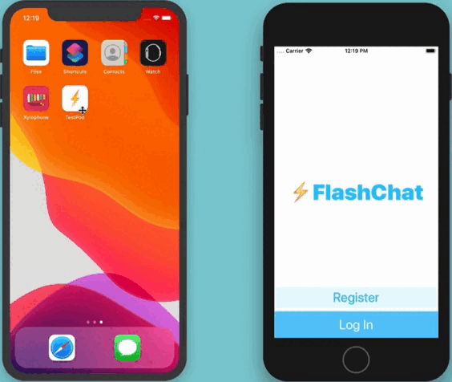

# Flash-Chat

## Goal

FlashChat is a versatile messaging application developed using Swift, Firebase, and CocoaPods. It offers users a seamless platform for real-time communication, featuring user authentication, registration, and messaging functionalities. The app follows the Model-View-Controller (MVC) architectural pattern and utilizes a navigation controller for efficient navigation between pages.

## Firebase Integration for Authentication 
FlashChat leverages Firebase Authentication to provide users with secure login and registration functionalities. Users can create an account, log in securely, and access the app's features using Firebase Authentication.

## Real-Time Messaging with Firebase 
The app utilizes Firebase Realtime Database or Firebase Cloud Firestore to enable real-time messaging between users. Users can send and receive messages instantly, facilitating seamless communication.

## Custom Views with .xib Files 
Custom views are created using .xib files to modify native design components and customize the app's user interface. This allows for a unique and polished design, providing users with an engaging and visually appealing experience.

## User-Friendly Interface with Table View 
FlashChat presents user chats in a user-friendly interface using a table view. Each chat message is displayed as a table view cell, allowing users to easily view and interact with their messages.

## Navigation Controller for Page Navigation 
The app incorporates a navigation controller to manage the navigation flow between different pages. Users can navigate between authentication pages, chat rooms, and other sections of the app effortlessly.

## Animated Chat Title Display with CocoaPods
FlashChat utilizes CocoaPods to integrate a chat title display animation. This animation enhances the visual appeal of the app's user interface, providing users with an engaging and immersive messaging experience.

Flash Chat is an internet based messaging app similar to WhatsApp, the popular messaging app that was bought by Facebook for $22 billion. 